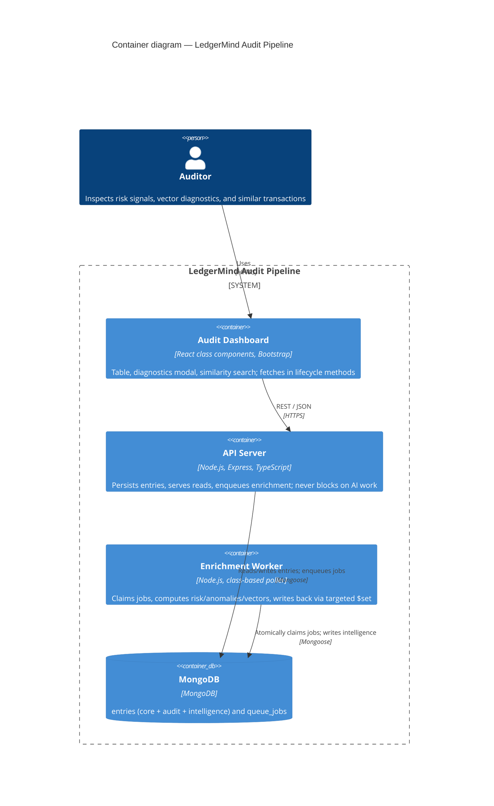
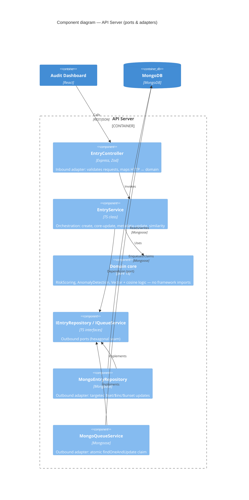

# LedgerMind Audit Pipeline

> Event-driven MERN application for ingesting immutable financial journal entries and
> asynchronously enriching them with AI-style audit intelligence — context-aware risk
> scoring, granular anomaly detection, compliance evaluation, and multi-space vector
> similarity search.

> **Status:** 🚧 Work in progress. This README is built up incrementally alongside the
> codebase; sections are filled as each phase lands. See `git log` for the increment trail.

---

## 1. Project Overview

_TBD — expand as features land._

## 2. Architecture (C4)

### 2.1 Container diagram

How the running pieces fit together. The API stays low-latency by offloading expensive
enrichment to a separate worker, decoupled through a MongoDB-backed queue.



### 2.2 Component diagram — API Server

Inside the API container: a light hexagonal (ports & adapters) layout. Services depend on
**ports**, not on Mongoose, so persistence and queue adapters are swappable and the domain
core stays pure and unit-testable.



> The **Enrichment Worker** is its own container (diagram 2.1) and reuses the same
> `MongoEntryRepository` / `MongoQueueService` adapters to claim jobs and persist results.

## 3. Technology Stack

- **Backend:** Node.js, Express, TypeScript, Mongoose, Zod (request validation)
- **Database:** MongoDB
- **Worker:** MongoDB-backed queue + class-based polling worker
- **Frontend:** React (class components only), Bootstrap
- **Architecture:** light hexagonal (ports & adapters) + class-based service/repository layers

## 4. Folder Structure

```
ledgermind-audit-pipeline/
  server/
    src/
      domain/         # pure logic: risk, anomaly, vectors, value objects (no Mongo)
      application/    # EntryService, ComplianceReevaluationService (orchestration)
      ports/          # IEntryRepository, IQueueService interfaces
      adapters/
        http/         # EntryController, routes (inbound)
        persistence/  # Mongoose models, MongoEntryRepository (outbound)
        queue/        # MongoQueueService
      worker/         # EnrichmentWorker
      scripts/        # seed, migrateModels, reevaluateRisk
  client/             # React class-component dashboard
  README.md
  .env.example
```

## 5. Environment Variables

See `.env.example`. Copy to `server/.env` and adjust. Key vars: `PORT`, `MONGODB_URI`,
`MODEL_VERSION`, `RISK_VERSION`, `WORKER_ENRICH_DELAY_MS`, `BATCH_SIZE`.

## 6. Setup Instructions

```bash
npm run install:all
cp .env.example server/.env
```

## 7. MongoDB Setup

_TBD — local mongod / Atlas connection notes._

## 8. Seed Command

```bash
npm run seed
```

## 9. Server Start

```bash
npm run start:server
```

## 10. Worker Start

```bash
npm run start:worker
```

## 11. Client Start

```bash
npm run start:client
```

## 12. Model Migration

```bash
npm run migrate:models
```

## 13. Risk Reevaluation

```bash
npm run reevaluate:risk
```

## 14. API Endpoint Documentation

_TBD — table of routes lands in Phase 3._

## 15. Async Queue Design

_TBD — Phase 4._

## 16. Race-Condition Mitigation

_TBD — atomic claim via findOneAndUpdate, lockedAt/lockedBy._

## 17. Cursor Pagination / Backpressure

_TBD — Phase 6._

## 18. Partial Recomputation

_TBD — core-field change detection vs metadata-only updates._

## 19. Class-Component Frontend Constraint

_TBD — why class components, lifecycle-driven data fetching._

## 20. Demo Walkthrough Checklist

_TBD — Phase 8._
