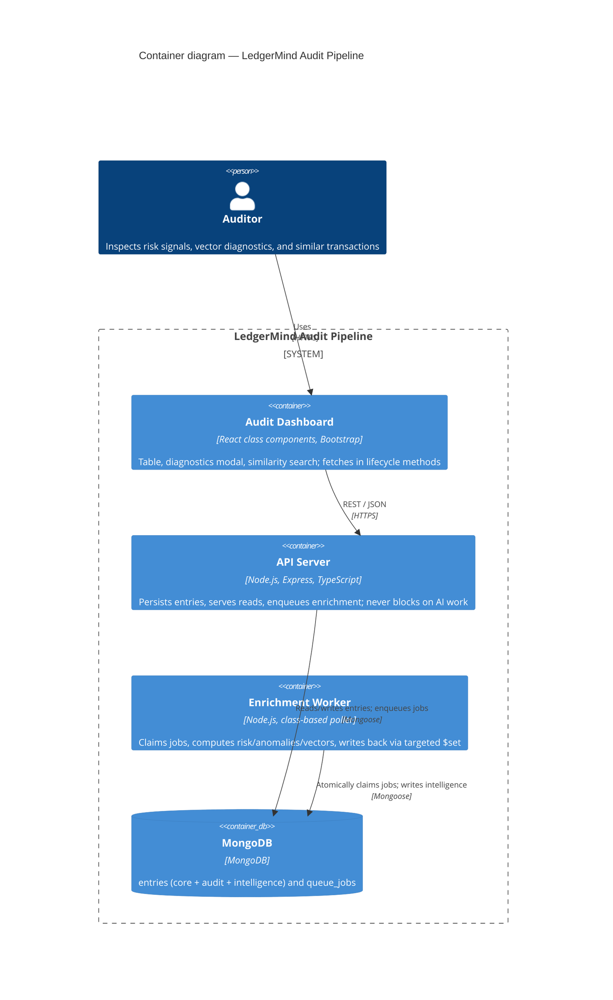
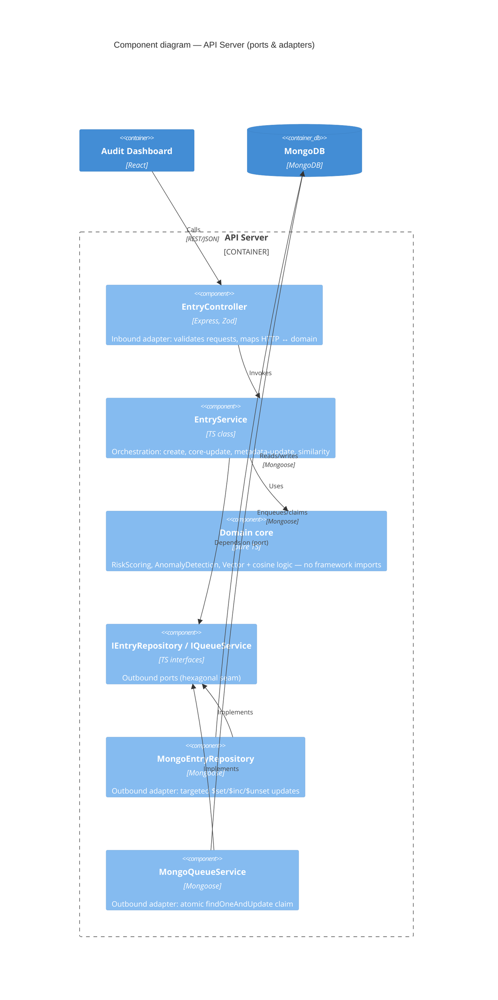

# LedgerMind Audit Pipeline

> Event-driven MERN application for ingesting immutable financial journal entries and
> asynchronously enriching them with AI-style audit intelligence — context-aware risk
> scoring, granular anomaly detection, compliance evaluation, and multi-space vector
> similarity search.

> **Status:** ✅ Feature-complete — backend (Express + worker + admin scripts), predictability
> layer, and the React class-component client. Built incrementally; see `git log` for the trail.

---

## 1. Project Overview

LedgerMind ingests immutable financial journal entries and asynchronously enriches them
with AI-style audit intelligence. The design separates low-latency transactional ledger
records from higher-cost analytical processing: a create request persists the baseline
entry and returns immediately, while a background worker computes context-aware risk
scores, granular anomalies, compliance flags, and three vector embedding spaces, writing
them back with targeted updates.

The backend is Node.js/Express in TypeScript with a light hexagonal (ports & adapters)
layout and class-based service/repository layers; persistence is MongoDB via Mongoose using
targeted update operators (never root-document rewrites); enrichment is decoupled through a
MongoDB-backed job queue with atomic claiming. The frontend (Day 4–5) is a React
class-component dashboard for auditors to inspect risk signals, vector diagnostics, and
similar transactions.

## 2. Architecture (C4)

### 2.1 Container diagram

How the running pieces fit together. The API stays low-latency by offloading expensive
enrichment to a separate worker, decoupled through a MongoDB-backed queue.



### 2.2 Component diagram — API Server

Inside the API container: a light hexagonal (ports & adapters) layout. Services depend on
**ports**, not on Mongoose, so persistence and queue adapters are swappable and the domain
core stays pure and unit-testable.



> The **Enrichment Worker** is its own container (diagram 2.1) and reuses the same
> `MongoEntryRepository` / `MongoQueueService` adapters to claim jobs and persist results.

## 3. Technology Stack

- **Backend:** Node.js, Express, TypeScript, Mongoose, Zod (request validation)
- **Database:** MongoDB
- **Worker:** MongoDB-backed queue + class-based polling worker
- **Frontend:** React (class components only), Bootstrap
- **Architecture:** light hexagonal (ports & adapters) + class-based service/repository layers

## 4. Folder Structure

```
ledgermind-audit-pipeline/
  server/
    src/
      domain/         # pure logic: risk, anomaly, vectors, value objects (no Mongo)
      application/    # EntryService, ComplianceReevaluationService (orchestration)
      ports/          # IEntryRepository, IQueueService interfaces
      adapters/
        http/         # EntryController, routes (inbound)
        persistence/  # Mongoose models, MongoEntryRepository (outbound)
        queue/        # MongoQueueService
      worker/         # EnrichmentWorker
      scripts/        # seed, migrateModels, reevaluateRisk
  client/             # React class-component dashboard
  README.md
  .env.example
```

## 5. Environment Variables

See `.env.example`. Copy to `server/.env` and adjust. Key vars: `PORT`, `MONGODB_URI`,
`MODEL_VERSION`, `RISK_VERSION`, `WORKER_ENRICH_DELAY_MS`, `BATCH_SIZE`.

## 6. Setup Instructions

```bash
npm run install:all
cp .env.example server/.env
```

## 7. MongoDB Setup

Any MongoDB 6.0+ instance works. Point `MONGODB_URI` at it in `server/.env`.

- **Local:** install MongoDB Community and run `mongod`, then use
  `mongodb://127.0.0.1:27017/ledgermind`.
- **Docker:** `docker run -d -p 27017:27017 --name ledgermind-mongo mongo:7`.
- **Atlas:** paste your SRV connection string (credentials are redacted from logs).

Indexes (status/severity for filtering, the unique partial idempotency index on the
queue) are created automatically by Mongoose on first connect.

## 8. Seed Command

```bash
npm run seed
```

## 9. Server Start

```bash
npm run start:server
```

## 10. Worker Start

```bash
npm run start:worker
```

## 11. Client Start

```bash
npm run start:client
```

## 12. Model Migration

```bash
npm run migrate:models
```

## 13. Risk Reevaluation

```bash
npm run reevaluate:risk
```

## 14. API Endpoint Documentation

All routes are prefixed with `/api`.

| Method | Path | Purpose |
| --- | --- | --- |
| GET | `/health` | Liveness, DB connectivity, queue depth by status |
| GET | `/entries` | List entries — `page`, `pageSize`, `severity`, `status`, `search` (entryNo/description/name) |
| POST | `/entries` | Create a journal entry; enqueues enrichment (non-blocking) |
| GET | `/entries/:id` | One entry with full intelligence metadata |
| PUT | `/entries/:id` | Update core fields; recomputes only if an analytical field changed |
| PATCH | `/entries/:id/audit-metadata` | Update status/comments only; never recomputes |
| POST | `/entries/search/similar` | Top-K similar entries — body `{ entryId, strategy, topK? }` |
| POST | `/admin/model-migration` | Trigger model migration (CLI alternative) |
| POST | `/admin/risk-reevaluation` | Trigger risk/compliance reevaluation (CLI alternative) |

Requests are validated with Zod at the controller boundary; failures return `400` with a
structured `error.details`. `404`/`409` map to not-found and optimistic-version conflict.

**Similarity example**

```bash
curl -X POST http://localhost:4000/api/entries/search/similar \
  -H 'Content-Type: application/json' \
  -d '{ "entryId": "<id>", "strategy": "financial", "topK": 5 }'
```

## 15. Async Queue Design

`POST /api/entries` persists the baseline record and returns immediately; enrichment is
never on the request path. A `QueueJob` (`ENRICH_ENTRY`) is inserted with `reason`
(`created` | `core_changed` | `model_migration`) and an idempotency key of
`entryId:reason:modelVersion`. The class-based `EnrichmentWorker` polls the queue, and each
tick claims one job, simulates model latency (`WORKER_ENRICH_DELAY_MS`, default 400ms),
runs risk + anomaly + compliance + vectors, and writes the result back with a single
targeted `$set`. The queue is MongoDB-native (no broker) so the whole system runs on one
dependency; the `IQueueService` port keeps it swappable for BullMQ/Redis.

## 16. Race-Condition Mitigation

Jobs are claimed atomically: `claimNext` runs a single `findOneAndUpdate` that flips
`status: pending → processing` and stamps `lockedAt` / `lockedBy` in one operation, so two
concurrent workers can never process the same job. Duplicate enqueues are prevented by a
**unique partial index** on `idempotencyKey` over active (`pending`/`processing`) jobs
only — completed/failed history is unaffected. Core updates use an **optimistic version
guard**: `updateCore` matches on `{ _id, version }` and `$inc`s the version, so a
concurrent double-submit conflicts (`409`) instead of silently overwriting. On the client,
save buttons are disabled while a request is in flight — a first-line guard against
sequential double-clicks, with the server-side version check as the authority.

## 17. Cursor Pagination / Backpressure

The migration and reevaluation scripts must not load the collection into memory. The
`IEntryRepository.iterate(batchSize)` port is backed by a Mongo **cursor** (`.cursor()`
with `.batchSize()`) and yields fixed-size batches; each batch is fully processed (and, for
migration, awaited per enqueue) before the next is pulled. Memory stays flat regardless of
collection size, and both scripts are restartable — idempotent enqueue means a re-run
won't double-queue in-flight work. List endpoints use standard skip/limit pagination capped
at 100 per page.

## 18. Partial Recomputation

Three update paths, three costs:

- **Metadata-only** (`PATCH /audit-metadata`, Scenario E): atomic `$set` on
  `auditMetadata.*`; no enrichment, intelligence untouched.
- **Core analytical change** (`PUT /entries/:id`, Scenario B): only a change to `amount`,
  `description`, `glNumber`, or `postingDate` marks intelligence stale and enqueues a full
  recomputation. Editing a non-analytical field (e.g. `name`) skips it.
- **Risk/compliance rule shift** (`reevaluate:risk`, Scenario D): recomputes risk,
  severity, anomalies, and compliance flags via targeted `$set` and deliberately leaves the
  (still-valid) vectors and `modelVersion` untouched — the expensive embeddings are never
  regenerated.

## 19. Class-Component Frontend Constraint

The spec mandates React class components (hooks/functional components prohibited for
primary structure). The dashboard is therefore built from `React.Component` classes
(`AuditDashboard`, `EntryTable`, `EntryDetailModal`, `VectorDiagnosticsPanel`,
`SimilaritySearchPanel`, `RiskBadge`), managing loading/modal/selection/search state in
`this.state` and fetching in lifecycle methods (`componentDidMount` for the initial load,
`componentDidUpdate` for selection-driven similarity queries, `componentWillUnmount` for
cleanup). _(Client lands in the Day 4–5 phase.)_

## 20. Demo Walkthrough Checklist

Run order (three terminals): `npm run start:server`, `npm run start:worker`, `npm run
start:client`; seed with `npm run seed` first.

1. **Seed + live enrichment (Scenario A).** Run `npm run seed`, open the dashboard. Entries
   appear `pending`; with the worker running, watch the worker terminal log
   `▶ claimed … ✔ enriched`, and the dashboard rows flip to `completed` with risk scores and
   severities within a few seconds — proving the create path never blocked on enrichment.
2. **Deep-dive diagnostics.** Click **Diagnostics** on a high-severity row (e.g. a `JE-400*`
   manual-adjustment or `JE-200*` high-value entry). Show the risk factors (explainable),
   the anomaly list, compliance flags, and the three vector previews.
3. **Similarity search.** In the modal, switch strategy (semantic/financial/entity) and show
   the top-5 matches — the duplicated-vendor seed rows (`JE-800*`) should surface as near
   matches with high scores.
4. **Core change → recomputation (Scenario B).** In Update Controls, change the amount and
   Save. The status shows `stale`, the worker logs a `core_changed` recomputation, and the
   modal refreshes to `completed` with a new score — vectors change too.
5. **Metadata-only (Scenario E).** Change the audit status / add a comment and Save. It
   persists immediately with **no** worker activity and **no** staleness — contrast with #4.
6. **Race guard.** Double-click Save quickly: the button disables in-flight; a genuine
   concurrent edit returns `409`.
7. **Batch scenarios (C/D).** In a terminal: `MODEL_VERSION=v2 npm run migrate:models`
   (watch cursor-batch progress logs, entries go `stale`, worker re-enriches), then
   `npm run reevaluate:risk` (risk/compliance recomputed, vectors untouched).

_Execution media: record steps 1–7 (dashboard + diagnostics modal + worker terminal) as the
walkthrough video referenced in the submission email._

## 21. Predictability & Load Behaviour

The design goal is a system with **one stable mode**: when it gets too busy it sheds or
defers work early rather than sliding into timeouts and tail-latency collapse. Every
operation does a **bounded, known unit of work** — no unbounded fan-out, no hidden cost
that only appears under pressure.

**Per-operation cost budget**

| Operation | Bounded unit of work |
| --- | --- |
| `POST /entries` | 1 insert + at most 1 depth-check (TTL-cached) + 1 enqueue |
| `GET /entries/:id` | 1 indexed read |
| `GET /entries` | 1 filtered read + count, `pageSize ≤ 100` |
| `PUT /entries/:id` | 1 read + 1 version-guarded update (+ optional 1 enqueue) |
| `PATCH …/audit-metadata` | 1 targeted `$set` |
| `POST …/search/similar` | ≤ `SIMILARITY_CANDIDATE_LIMIT` vector comparisons (default 1000), `truncated` flag when capped |
| Worker tick | exactly 1 job |
| `migrate:models` / `reevaluate:risk` | 1 cursor batch of `BATCH_SIZE` at a time |
| Sweeper tick | reclaim stale + ≤ `SWEEPER_BATCH` enqueues |

**Rejection / shedding mechanisms**

- **Ingress rate limiting** (`RateLimiter`) — fixed-window per client; excess traffic gets
  `429` immediately instead of degrading everyone.
- **Request timeout** (`RequestTimeout`) — requests over the budget fail clean with `503`.
- **Admission control on the enrichment path** (`AdmissionControl`) — the immutable ledger
  write is *always* accepted; when the pending backlog exceeds `MAX_QUEUE_DEPTH`, new
  enrichment is deferred (entry stays `pending`) rather than admitted. The depth read is
  TTL-cached so the create path stays cheap.
- **Sweeper + reaper** (`EnrichmentSweeper`) — drains deferred/orphaned entries and reclaims
  jobs from crashed workers, in bounded batches.
- **Bounded resources** — Mongo `maxPoolSize` + `serverSelectionTimeoutMS` cap DB
  concurrency and fail fast; body size capped at 256kb; cursor batches keep migration memory
  flat.

The key property: because each operation's work is knowable in advance, the system's
behaviour under load is easy to reason about — it stays in its stable mode and rejects
early instead of collapsing.

## 22. Running with Docker

The whole stack comes up with one command:

```bash
docker compose up --build
```

This starts MongoDB, the API server (`:4000`), the enrichment worker (+ sweeper/reaper), a
one-shot seed, and the client served by nginx. Open the dashboard at
**http://localhost:8080**. Tear down with `docker compose down` (add `-v` to drop the
Mongo volume).

## 23. End-to-End Tests (Playwright)

`e2e/` contains a Playwright suite covering every required flow: async ingestion/enrichment
(Scenario A), the diagnostics modal, multi-space similarity search, core-update
recomputation (Scenario B), metadata-only bypass (Scenario E), and the save-in-flight race
guard.

```bash
docker compose up --build          # stack on :8080 (seeded automatically)
cd e2e && npm install
npx playwright install chromium    # first run only
npx playwright test                # runs against http://localhost:8080
```

Point it elsewhere with `E2E_BASE_URL` (e.g. the Vite dev server on `:5173`). To drive an
already-open Chrome over the **DevTools Protocol** instead of a managed browser, launch
Chrome with `--remote-debugging-port=9222` and run:

```bash
E2E_CDP_URL=http://localhost:9222 npx playwright test
```
